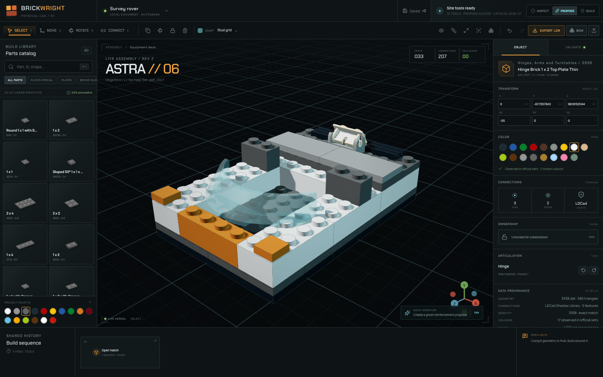
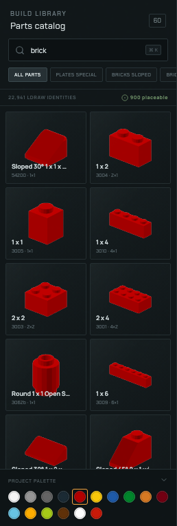
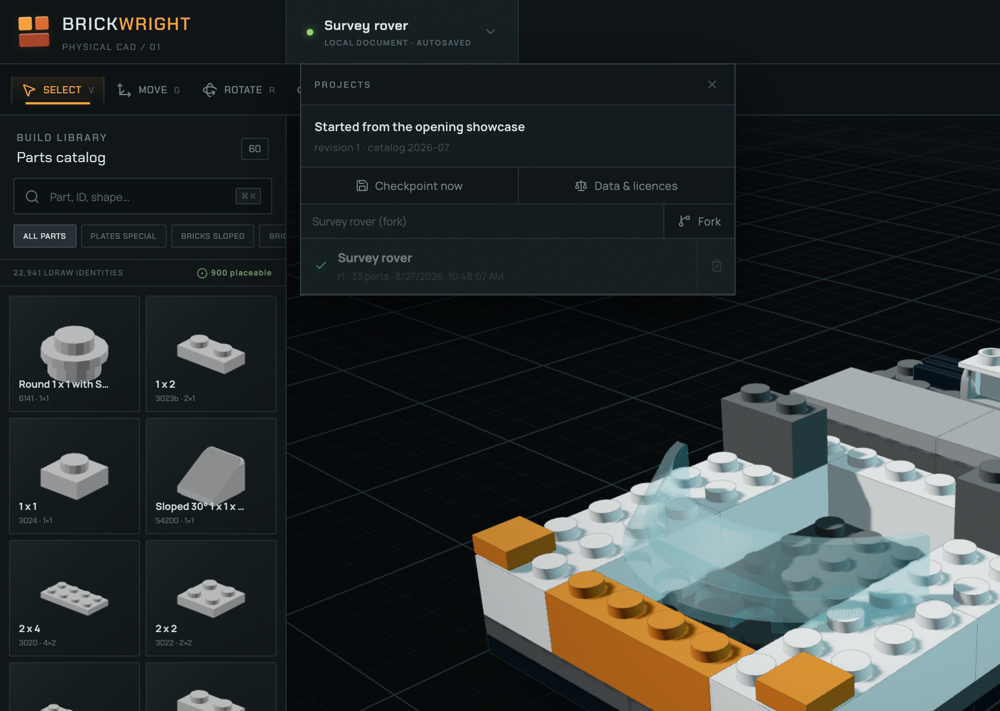
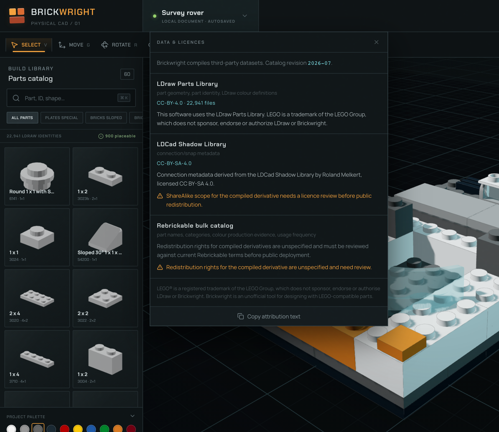

# Brickwright implementation progress

**Updated:** 2026-08-27 (productionization pass 14)
**Current state:** browser CAD system on the real compiled catalog, with an exact-transform kernel, 6-DOF snapping, persistent connection edges, triangle-confirmed collision and self-contained build-guide output

## Phase status

| Phase | Status | Implemented evidence | Missing before production |
| --- | --- | --- | --- |
| A — Data compiler | **Working** | Real compilation of LDraw 2026-07 + LDCad Shadow Library + Rebrickable bulk CSV: **81,774 indexed identities** (22,941 LDraw-modelled + 58,833 catalogued-only), 324,331 connectors, 322 colours, 1,150 renames resolved, **900 compiled meshes and 900 rendered thumbnails** with the opening showcase's parts pinned into the pack, per-file licence capture, content-hashed manifests, measured coverage report, deterministic fixture in CI | BVH serialization into the asset; full-library geometry behind lazy per-part fetch; ShareAlike/TOS review before public redistribution |
| A2 — Geometry compiler | **Working** | Full `.dat` dependency flattening with BFC `CERTIFY`/`CW`/`CCW`/`INVERTNEXT`, matrix-handedness winding, colour 16/24 inheritance, quad splitting, type-2 hard edges, 35° crease smoothing, SHA-256-named binary container, 0 unresolved references across 900 parts; runtime byte/hash/layout checks before decode | Texture/printed-part material slots; decimated LOD for very large panels |
| B — CAD kernel | **Working** | Pure TS document in LDraw's native frame with **exact matrix bases**; orthonormal-and-clean basis enforced on ingest; schema-2 migration; **patch-based transactions** with forward/inverse mutations and structural sharing; monotonic revisions, stale-write rejection, protected regions, connector-derived stacking planes | Named checkpoints/branches, multi-document tabs, operation-level schema validation |
| C — Renderer | **Working** | **Instanced batching** by part/colour with merged per-batch hard edges: 400 extra parts cost 14 extra draw calls, measured in the browser. Real compiled meshes, shared geometry per definition, per-slice materials for baked colours, transparent/metallic finishes from `LDConfig.ldr`, shadows, selection and ghost overlays outside the batches, camera views | GPU picking pass for very large models; section render mode; thumbnail cache for the palette |
| D — Human editor | **Working** | **Click-to-place with a connector-solved ghost**, **a visible translate/rotate gizmo with live snapped preview**, **shift-drag box selection**, **tiered, ranked, paged search across all 81,774 catalogued identities**, select/subassembly-select/recolour/duplicate/delete/connect/lock, first-run orientation, per-mode diagnostic legends, human-accessible render diagnostics, working command shortcuts and a discoverable command map | Palette drag-and-drop positioning, array/mirror UI, formal accessibility audit |
| E — Connections | **Working** | **Full 6-DOF frame solver** (`Tm = Tt·Ft·C·Fm⁻¹`): studs-not-on-top, right-angle Technic and hinge halves solve through the same expression as stacking. Per-family joint freedoms with closed-form continuous parameters, axial flip where insertion is two-sided, orientation-independent target discovery, axis-alignment requirement for a mate, occupancy exclusion, multi-match scoring, Connect-tool pinning. Classification grounded in measured Shadow Library conventions. **Persistent `ConnectionEdge`** records carrying joint, revision and provenance | Articulated manipulation UI driving the joint graph; per-family regression fixtures across the whole library |
| F — Collision | **Working** | Box broad phase → mated-connector clearance → **`three-mesh-bvh` triangle-pair confirmation**, with per-verdict certainty (`exact` / `clearance-subtracted` / `unknown`) surfaced in the UI. Eliminates the axis-aligned-box false positives that dominate rotated parts. Per-definition BVH cache | Penetration-depth discrimination inside the narrow phase; measured per-connector mating volumes replacing the family-level allowance; offline BVH serialization into the asset |
| G — Structural graph | **Working** | Connection graph from coincident compatible connectors with axis alignment, memoized per revision and shared by solver/validation/viewport; persisted edges with joint types; **rigid-component collapse and articulated joint driving** for hinges, pins, axles, bars and ball joints; component count, loose groups, weak single-connector attachments | Cut-set analysis, load-path tracing |
| H — Transactions | **Working** | Patch-based history: every transaction carries forward and inverse mutations plus the entity set it touched, so undo applies an inverse rather than restoring a document copy. **IndexedDB persistence** with periodic checkpoints, an append-only transaction log, replay on open, gap detection, legacy-`localStorage` migration, save-state reporting, project switching and safe forks | Named branches, project archives and a transaction compaction policy |
| I — WebMCP | **Working** | Dynamic 12/17-tool inventories; **schema-driven contracts** where the advertised JSON Schema is derived from the same Zod declaration the gateway enforces; a versioned tool profile with a drift-detecting hash; a **centralized sanitized error envelope** that redacts credentials, signed URLs, data blobs and filesystem paths and never relays a stack trace; bounded batch sizes; compact reads; catalog coverage; preflight/apply; render capture; capability virtualization | Native ChatGPT desktop acceptance run; cancellation propagation into asset fetches and workers |
| J — Agent UX | **Working** | Inspect/Propose/Build modes, visible ghosts, activity history, notes, locked cockpit, and **parametric assembly generators** that turn one instruction into a bonded storey with a measured report | Transaction-wave assembly animation, anchored 3D note authoring, autonomous hierarchical planning |
| K — Output | **Working slice** | `.ldr` and `.mpd` export with `STEP` and one submodel per subassembly; import flattens nested submodels and reports unplaceable references; exact IDs/transforms; BOM CSV | BrickLink XML; step reassignment on import |
| L — Instructions | **Working slice** | **Build order derived from the connection graph**, independently verifiable reachability, step-aware timeline/playback, and a printable offline HTML booklet with fixed-camera assembly renders, highlighted new parts, BOM, warnings and provenance | Technique-aware grouping, hiding internals until they matter, automatic sub-model selection |
| M — Polish | **Strong slice** | Deliberate industrial CAD UI, responsive desktop layout, catalog boot/failure screens, project/release surfaces, first-run guide, keyboard guide, blank-project and empty-viewport states, rename and new-project actions, dynamic document identity and deterministic browser acceptance including reload/restore and guide export | Formal accessibility audit, deployment/CDN |

## Verified now

`npm run check` — **310 tests across 30 files**, strict TypeScript, production Vite build. The compiler is
driven in-process against committed fixtures, so CI asserts its semantics — colour crosswalk,
snap-grid expansion, measured bounds, hashed files, determinism — not just that it exits zero.

`npm run test:e2e` — real Chromium/WebGL run asserting relationships rather than magic numbers:

```json
{
  "catalog":  { "identities": 22941, "placeable": 900, "colors": 322 },
  "index":    { "modelledIdentities": 22941, "cataloguedIdentities": 58833,
                "totalIdentities": 81774, "exactNumberRanksFirst": "3001",
                "searchMs": { "wholeIndex": 44, "describedPart": 11, "partNumber": 9 },
                "panelTotal": "8,836 of 81,774 identities" },
  "coverage": { "authoritativeConnections": 17364, "connectors": 324331,
                "compiledMeshes": 900, "triangles": 961732 },
  "showcase": { "parts": 33, "connections": 207, "collisions": 0,
                "unverifiedCollisions": 0 },
  "rotatedBoxProbe": "triangle confirmation cleared the box overlap",
  "meshAssetsFetched": 11,
  "interface": { "modalShortcutsBlocked": true, "focusRestored": true,
                 "firstRunGuideShownOnceOnly": true,
                 "gizmoScreenPixels": 205, "gizmoDragCommitted": true,
                 "viewportPlacement": { "parts": 36, "revision": 3 },
                 "boxSelection": "32 parts selected",
                 "buildStepsVisibleAfterEdit": 6 },
  "importRoundTrip": { "parts": 35, "connections": 211 },
  "generation": { "storeyParts": 62, "storeyCourses": 4, "runningBond": true,
                  "partsFromTwoCalls": 186, "transactions": 2, "collisions": 0,
                  "sequencedSteps": 31, "sequenceVerified": true,
                  "buildingParts": 326, "buildingWindows": 6, "buildingDoors": 1,
                  "moduleStampedParts": 326, "blockCollisions": 0 },
  "refusedUnplaceableIdentity": "61072",
  "contractEnforcement": { "profile": "brickwright.tools/3",
                           "malformedBatch": "INVALID_INPUT",
                           "shearedBasis": "INVALID_INPUT",
                           "staleProfile": "STALE_TOOL_PROFILE" },
  "renderScale": { "partsAfterBatch": 435, "drawCallsBefore": 226,
                   "drawCallsAfter": 240, "drawCallsAddedBy400Parts": 14,
                   "trianglesAfter": 472452 },
  "delivery": { "mpdFileBlocks": 5, "guideSteps": 6,
                "guideImages": 36, "guideBytes": 507999 },
  "reloadRestored": { "revision": 8, "parts": 35, "name": "Survey rover" },
  "exportType1Lines": 35
}
```

The same acceptance flow also passes against the production preview. The run confirms: the
placeable set is a strict subset of the catalog; compiled
`.bwmesh` assets actually reach the GPU; leaving Build mode revokes write tools; preflight
does not mutate; acceptance is exactly one revision; an unplaceable identity is refused with
`GEOMETRY_UNAVAILABLE`; a stale plan is refused with `STALE_DOCUMENT`; a 12 LDU
bounding-box overlap between a rotated brick and its neighbour is cleared by triangle
confirmation; the shortcut dialog blocks model commands and restores focus; and the export's
type-1 line count matches the document.

The editor opens on an empty project. The 33-part rover this used to describe is now a
unit-test fixture (`createShowcaseDocument`) rather than what anyone opens: **207 mated
connectors, 0 collisions and 1 connected component**, still verified by a unit test so the
invariant cannot regress, but no longer a copy handed to every new project.

## Productionization pass 1

Worked in the order the productionization plan sets out, on the grounds that a wrong
snap/collision layer only makes an agent produce incorrect work faster.

1. **Exact transforms.** Euler degrees are no longer persistent truth. The document stores
   an orthonormal row-major basis — the same nine numbers an LDraw type-1 line carries — so
   an arbitrary off-axis rotation and a mirrored reference round-trip exactly. This also
   fixed a latent export defect: decomposition was previously lossy for anything that was
   not a quarter turn.
2. **Persistent connection edges.** `document.connections` records each mated pair with its
   joint freedom, the revision it appeared at and its provenance, so the structural graph
   survives save, load and export instead of being re-inferred anonymously.
3. **6-DOF snapping.** The solver composes connector frames rather than translating, so it
   derives orientation. A brick now lands correctly on the sideways stud of a headlight
   brick or bracket — 36 such parts are in the pack — which the previous translation-only
   solver could not express at all. Continuous joint parameters are solved in closed form.
4. **Collision narrow phase.** `three-mesh-bvh` triangle confirmation behind the box phase
   and the mating-clearance layer, with certainty on every verdict.

Two bugs surfaced and were fixed while doing this: target discovery depended on cursor
*orientation*, hiding every sideways-stud target; and `bvhcast` candidate pairs were being
depth-tested before being intersected.

## Productionization pass 2

Continuing in plan order: transactions, persistence, incremental validation.

**Patch-based transactions.** A transaction now carries forward and inverse
mutation lists instead of before/after document copies. Untouched parts are
shared by reference, so an edit to one brick no longer deep-copies the model.
Granularity follows cardinality: parts, subassemblies and connection edges are
patched per entity; steps, notes and constraints are replaced wholesale because a
document holds a handful and index bookkeeping would cost more than it saves.

**IndexedDB persistence.** Projects are stored as a periodic checkpoint plus the
transaction log that follows it, so write cost is proportional to the edit rather
than to the model, and reopening replays forward from the checkpoint. Replay
stops at a revision gap rather than applying a log out of order. A document
written by the previous `localStorage` build is migrated rather than discarded.
The save indicator distinguishes durable, memory-only and failed.

**Incremental revalidation.** Three changes, measured on a 1,000-part lattice:

| | before | after |
| --- | ---: | ---: |
| 1,000 sequential commits | 10,415 ms | **549 ms** |
| per commit | 10.4 ms | **0.55 ms** |
| full validation | — | 41 ms |
| revalidation after one part moves | — | 45 ms |
| snap query in a dense model | — | 23 ms |

- Validation is **lazy**: `EngineSnapshot.validation` is a memoizing getter, so
  the many commits whose intermediate report is never read stop paying for one.
- Collision has a **uniform-grid broad phase**, replacing the O(n²) pairwise
  loop, and only pairs involving a touched part are rechecked — previous
  verdicts about untouched pairs carry forward.
- The **connector index is maintained across revisions**, withdrawing and
  reinserting only touched parts instead of rebuilding per commit.

Each of those is an optimization, so each is paired with an equivalence test: the
incremental collision result must match a from-scratch pass, and the persisted
connection graph must match a full derivation after a run of adds, moves,
removals, undo and redo. An optimization that changes answers is a defect.

## Productionization pass 3

**Instanced rendering.** Parts sharing a definition and a colour differ only by
transform, so they now render as one `InstancedMesh` per group. Selected,
flagged and gizmo-attached parts stay outside the batches, since pulling an
instance out to highlight it would rebuild the batch on every hover.

Measuring it exposed a second problem the first fix had hidden. With surfaces
batched, per-part hard edges became the dominant cost: a 400-part batch added
**810** draw calls. Line geometry has no instanced equivalent without a custom
shader, so each batch's edges are now merged into a single buffer with member
transforms baked in, rebuilt on commit rather than per frame. Result, measured in
the browser with the renderer's own counters:

| | draw calls |
| --- | ---: |
| 33-part showcase | 198 |
| after a 400-part batch | **212** |

That is +14 for 400 parts, against +810 before merging, while rendering 463,572
triangles — the counters are sampled across full frames with `autoReset` off,
because the gizmo helper draws in its own pass and a naive sampler sees only
whichever pass finished last.

**Schema-driven WebMCP contracts.** Operation payloads were previously advertised
as an array of bare objects and validated nowhere; each handler did its own
coercion. Now one Zod declaration produces both the JSON Schema the tool
advertises and the validation the gateway enforces, so the two cannot drift. The
operation vocabulary is a real discriminated union, batches are bounded, and a
sheared rotation matrix is refused rather than silently normalized.

**Sanitized error envelope.** A tool error is model input, so all of them now pass
through one redactor: bearer tokens, `api_key=`-style pairs, signed URLs, base64
data URLs, long opaque blobs and local filesystem paths are stripped, messages
are length-capped, and a stack trace never reaches the agent. Staleness codes are
marked retryable so an agent knows to reread rather than give up.

**Tool profile hash.** `workspace_get` returns a versioned profile and a hash over
the exposed tool names plus the catalog revision. A mutation may pin it, and a
plan made against a surface that has since changed is refused with
`STALE_TOOL_PROFILE` instead of executing against a contract the agent never saw.

## Productionization pass 4

**Articulated manipulation.** The connection graph already recorded a joint
freedom on every edge, but that freedom conflated two different things, and the
distinction turned out to be the whole problem:

- *Placement* freedom is what the snap solver uses. A round stud admits any
  rotation about its axis, which is why a 1×1 plate can be turned on its stud.
- *Articulation* freedom is what a built model retains. A stud connection is
  rigid once assembled — friction holds it, and nothing about a finished brick
  wall hinges. Only interfaces designed to move articulate.

Treating stud connections as rigid for articulation is what makes "rotate this
hinge" carry the whole flap rather than peeling one plate off the assembly. The
moving side is the selection's rigid group; everything else anchors it. A joint
whose two sides land in the *same* rigid group is skipped, because a closed loop
cannot articulate without deforming.

Limits are enforced in the kernel, not the UI, so an agent call is clamped the
same way: a keyed axle only seats at quarter turns, a prismatic joint respects its
axial range, and a joint whose freedom is unmodelled drives nothing rather than
guessing.

The showcase now contains a hinged rear hatch, so the model carries a real
mechanism instead of only rigid connections. Placing it surfaced two things worth
recording. The hinge top plate has no anti-studs at all, so deriving its origin
from a surface plane is meaningless — it belongs wherever its hinge connector
coincides with its counterpart's, which needed an explicit placement path. And
hinge halves interleave their fingers, so two correctly hinged parts share a
substantial bounding volume; the collision clearance had to recognize that.

The colour-evidence check also did its job unprompted: the hatch was first built
in the rover's orange accent, and part 3938 has no observed official-set
appearance in orange. It is white.



## Productionization pass 5

**Derived build order.** Instruction steps are not a cosmetic grouping: a step is
only meaningful if everything it introduces can actually be attached to what is
already in front of the builder. That makes sequencing a precedence problem over
the connection graph, not a spatial sort.

Growth is frontier-first — at each point the candidates are the unplaced parts
that already touch placed structure — with ties breaking downward, because LDraw
is Y-down and building bottom-up is both what a person does and what keeps a step
reachable. On the showcase this produces 7 steps covering all 35 parts with no
warnings.

The guarantee is deliberately narrow and independently checkable: **every part
after the first step connects to structure placed earlier, unless it begins a new
independent subassembly**, which is reported rather than glossed over.
`verifyBuildOrder` checks that property against any sequence, including one a
human reordered by hand, and a test asserts it catches a deliberately broken
order. Producing genuinely *good* instructions — grouping by technique, hiding
internals until they matter, choosing where to sub-model — is a larger problem and
is not claimed.

## Productionization pass 6

**Rendered part thumbnails.** The palette showed a derived footprint glyph — a
proportionally-correct rectangle with the right stud count, but not the part. It
now shows the part.

The renderer is a software rasterizer in the compiler, not a headless browser:
the catalog build has to run under bare `node` in CI, output bytes have to be
reproducible because asset hashes depend on them, and a palette preview needs a
clean orthographic three-quarter view rather than a photoreal render. Nine
hundred parts take a few seconds. PNG rather than WebP because Node ships zlib
but no WebP encoder, and adding a native dependency to the catalog build for a
2 KB preview is a poor trade.

The output is deliberately **colour-independent**: RGB carries shading and alpha
carries coverage, so the runtime tints one asset with any of the 322 LDraw
colours by masking a coloured layer with the alpha and multiplying the shading
over it. Baking colour in would have meant 900 parts × hundreds of colours of
assets to show a brick in the colour the operator actually selected.

Rendering the previews immediately caught a sign error worth recording: with
LDraw's Y-down convention the first camera looked *up* at every part, so the
palette showed hollow undersides and anti-stud tubes instead of studs.

**Wider geometry pack.** 500 → **900** placeable parts, 47.7 MB of geometry plus
2.0 MB of thumbnails.



## Productionization pass 7

**Projects, checkpoints and a visible restore report.** The persistence layer
had supported multiple projects, explicit checkpoints and log replay since pass
3, but the editor exposed none of it — the header's project chevron was a dead
affordance. It is now a switcher.

The interesting part is not the list, it is what a switch has to guarantee.
Autosave is a serialized queue, so at the moment an operator clicks another
project there may be appends still in flight. `session.openProject` therefore
awaits the queue *and* writes a checkpoint for the outgoing project before
anything replaces the document — leaving is not allowed to be a way to lose the
last edit. Two consequences are asserted rather than assumed: reopening a
project needs zero replay because it was checkpointed on the way out, and a
transaction committed in the same tick as the switch is still there when the
project is reopened.

Forking is a new project id, a fresh checkpoint and an empty log, so two designs
can never replay into each other. The id is disambiguated against the projects
that already exist rather than assumed unique, because the name slug collides the
second time the same fork name is used and a collision here would silently
overwrite somebody's work. Deleting the open project is refused: autosave would
recreate its checkpoint moments later, so the delete would appear to work and
then undo itself.

The restore report is now shown instead of inferred. The browser acceptance run
reads it back: after a reload the panel says *"Restored from a checkpoint, 7
transactions replayed"*, which is the crash-and-reopen path stated in the UI
rather than claimed in a document.



**Attribution is now in the product.** The catalog compiler had been writing a
per-dataset licence manifest — observed per-file licences, attribution strings,
and explicit review-required flags — into a build artefact nobody could see.
Attribution that only exists in a build artefact is not attribution. The panel
lists all three datasets with their licences, shows the two outstanding review
requirements in warning colour rather than burying them, carries the LEGO
trademark disclaimer, and copies the whole attribution block to the clipboard.
The acceptance run asserts the datasets, the review flags and the disclaimer are
all present in the DOM.



## Productionization pass 8

**A delivery center, not a row of file buttons.** The toolbar now keeps the fast
one-click LDR path and opens a compact release surface for hierarchical MPD, BOM,
import and a printable build guide. It states the exact source revision, part and
connection counts, collision state and local-only data boundary before anything
leaves the editor. Diagnostic render modes are now available to the human, the
project name in the viewport is real rather than hard-coded showcase copy, `⌘K`
actually focuses part search, `F` really reframes an unchanged view, and `?` opens
a keyboard map. The duplicated articulation inspector block and nested interactive
catalog-card markup found during the audit were removed.

**Self-contained printable instructions.** The build guide is one offline HTML
file: cover, verification status, BOM, fixed-camera step renders, saturated and
outlined new parts, washed existing structure, explicit missing-geometry warnings,
dataset attribution and no remote dependencies. A deterministic software rasterizer
runs independently of WebGL so pixel behaviour can be unit-tested. The browser
acceptance generated the real rover guide with **6 steps, 36 embedded PNGs and
507,999 bytes**, reopened it, and found no broken images.

**Assets are verified before they become CAD input.** The runtime now checks the
declared byte length and SHA-256 of all four catalog payloads and every fetched mesh.
The binary decoder checks its exact layout, finite ordered bounds, triangle/edge
cardinality, slice ranges, finite positions/normals and index bounds before creating
Three.js geometry. `npm run bootstrap` performs the same verification over the whole
committed 900-part pack and its thumbnails; the current run checked **1,786 unique
immutable assets**. Runtime and WebMCP identifiers now use `crypto.randomUUID()`, and
package versions plus the Node/npm range are exact rather than floating on `latest`.
The Vite 8 build now separates React, rendering, contracts and UI with Rolldown's
native code-splitting groups: the largest emitted JavaScript chunk is **373.57 kB**
uncompressed, and the production build completes without a chunk-size warning.

## Productionization pass 9

**Hard design constraints are enforced by the kernel, for every actor.** The `hard`
flag on a constraint had been carried through the schema, the WebMCP contract and
the capability registry without ever changing what `execute` does. It does now: a
transaction that would *newly* break a hard constraint is refused with
`CONSTRAINT_VIOLATION`. The refusal is not actor-scoped, because a design limit is
the operator's own declared intent rather than a physical fact discovered about the
model — which is the opposite of how collisions are treated, and deliberately so.

Three properties make the gate usable rather than merely strict, and each is now a
test rather than an intention:

- **Only newly introduced failures refuse.** A constraint that is already failing
  must not lock the document, or tightening a budget below the current build would
  make every subsequent repair impossible.
- **Declaring is not violating.** A constraint the transaction itself introduces or
  rewrites is skipped, so an operator can state a target the build has not reached
  yet. Without this the refusal message's own advice — soften or remove the
  constraint — was a dead end, because softening is itself a `constraint.set`.
- **Advisory constraints report and never block**, which is the whole difference
  between `hard: true` and `hard: false`.

**The gate cost nothing to add and nearly everything to run.** Enforcing it had been
written as two full `validateDocument` passes per commit, hoisted out of the
`actor === 'agent'` branch that previously contained them. Validation runs collision
detection, so every human edit began paying for a whole verification sweep: the
1,000-part commit benchmark went from a measured 0.55 ms/commit to **14.7 ms**, and
the unit suite from 2.5 s to 16.2 s. Constraints need only the part list and the
document envelope, so they now read a scoped `evaluateConstraints` — shared with
`validateDocument` so the two cannot drift — and a document declaring no hard
constraint skips the gate entirely.

| | per commit | unit suite |
| --- | ---: | ---: |
| gate as written | 14.7 ms | 16.22 s |
| gate scoped to constraints | **0.55 ms** | **2.43 s** |

**The human surface caught up with the agent's.** `SHARED_MUTATION_CAPABILITIES`
advertises `parity: { human: true, agent: true }` on every entry, but the four
constraint capabilities — size envelope, piece budget, palette, remove — were absent
from the Command Deck's group order and unhandled in its argument builder, so they
were invisible to the human and would have run with no arguments. They are wired up,
including an enforcement toggle that says which of the two things `hard` means. The
acceptance run now compares the deck's rendered command count against the registry
the agent queries, instead of against a literal that had been written to match the
incomplete state.

## Productionization pass 10

**The editor could not be operated with a mouse.** Nine passes had built an exact
transform kernel, a 6-DOF connector solver and a triangle-confirmed collision
narrow phase, and then handed all of it to an interface that had no way to put a
brick where you were looking and no visible gizmo to move one afterwards. Both
were code that ran and produced nothing on screen, which is the failure mode that
a component-mounted assertion cannot catch.

- **The transform gizmo was drawn twenty times too small.** `TransformControls`
  sizes its handles from the camera distance and then inherits its parent's
  scale like any other object. It was mounted inside the model root, which
  scales LDU into scene units at 1/20, so a 0.72-size gizmo rendered at roughly
  nine screen pixels: present in the scene graph, invisible and unhittable. It
  now attaches to a proxy carrying the selection's pose in *scene* space, and
  every pose read back is mapped through the root's inverse before it reaches
  the document. The acceptance run measures the **drawn handles** rather than
  asserting that a component mounted — **205 screen pixels**, and a scripted drag
  on them commits exactly one transaction.
- **Dragging now previews what the drop will do.** The pose under the cursor is
  quantized and then run through the same connector solver a commit uses, so the
  part settles into its mate while the operator is still holding it. The solver
  is re-entered only when the quantized position changes, which keeps a dense
  model's 23 ms snap query off the per-frame path.
- **Click-to-place.** Choosing a part in the library arms it; a ghost follows the
  cursor, resting the part's own underside plane on whatever the ray strikes —
  the target's exposed stud plane, its measured top face, or the ground — and
  then offering that pose to the 6-DOF solver. `R` turns it, `Esc` puts it back,
  and each click drops another. The solve moved out of the viewport into
  `cad/placement.ts`, because deciding where a part lands is kernel work and
  should be testable without a GL context; it now is, against real fixture
  geometry.
- **Shift-drag box selection.** `OrbitControls` claims shift-drag for panning, so
  it is disabled for exactly the duration of the drag and restored afterwards,
  including on a pointer release outside the canvas. Parts behind the camera are
  excluded, since their mirrored projection would otherwise land inside the
  rectangle.

**The viewport stopped fighting the operator.** Framing was triggered by document
bounds, so placing a brick past the model's edge threw away the viewpoint the
operator had just orbited to. It now reframes on the things that actually replace
what is on screen — a named view, an explicit fit, opening a different document,
exploding the model — and the exploded view frames the exploded extent rather
than the assembled one it is no longer showing.

**Two panels were describing a model that was not there.**

- The bottom band was labelled "Build sequence" and swapped the sequence out for
  edit history the moment anything was edited, so the steps vanished exactly when
  a builder started using the tool. They are now separate views behind an
  explicit switch, and a step's completion tick reflects the playback position
  instead of a hardcoded `index < 4`.
- A new project was a copy of the showcase's structure: a blank document opened
  with "Cockpit", "Hull walls" and a rover piece budget already in it. Forking was
  also the only way to get a second project at all. `createBlankDocument` gives a
  new project one unlocked assembly and one step, and the switcher offers **New**
  and **Rename** alongside **Fork** — rename through the command bus, so it is a
  revisioned, undoable transaction like every other edit.

**Everything else that had no answer on screen.** A first-run guide that states
the four things the console assumes you know, and stays reachable from the
keyboard map afterwards. An empty-viewport prompt, because a blank grid is not an
instruction. A legend for each diagnostic render mode, because the connector map
is meaningless to anyone who does not already know that orange is male. A catalog
empty state that says why nothing matched and offers the wider search. A working
palette expander, where the chevron had been inert. Active states on the camera
buttons, shortcut-bearing tooltips on every icon-only control, and a toast that no
longer covers the metrics it is reporting on.

**What the acceptance run now proves that it could not before:** that the gizmo is
large enough to grab and that grabbing it commits; that a viewport click places
exactly one part in one transaction; that shift-drag selects a region; that the
build sequence survives an edit; that the first-run guide appears once and not
again; and that an exported `.ldr` imports back as the same 35-part build with a
derived connection graph.

## Productionization pass 11

**The index answered for LDraw, not for LEGO.** Every search — human or agent — ran against
the 22,941 identities LDraw models, and the app called that "the catalog". Rebrickable's
bulk data, already downloaded and already parsed by the compiler for names, categories and
colour evidence, lists **64,347** parts. Asking for a printed torso, a Duplo brick or a
sticker sheet returned nothing, and nothing distinguished that from asking for a part that
does not exist.

**Three tiers, published as such.** The compiler now emits a second index of the 58,833
catalogued identities no LDraw file models, and every search result carries the tier it came
from:

| Tier | Count | What is known | What can be done |
| --- | ---: | --- | --- |
| `placeable` | 900 | Compiled geometry, measured envelope, LDCad connectors | Built with |
| `modelled` | 22,041 | LDraw models the shape and connections; no mesh here | Inspected |
| `catalogued` | 58,833 | Name, category, official-set appearances | Confirmed real |

The tier is a *ranking* input, not a filter: asking for "2 x 4 brick" across everything still
puts `3001` first rather than burying it under printed variants. Facet counts are computed
across all three tiers regardless of which one is being shown, so a zero in one tier is
visibly a zero *of matches* rather than a zero of coverage — and where the wider index has
not been fetched yet, the count reads `·` and the agent response says
`cataloguedTierSearched: false`, because a zero that means "not looked" must not be reported
as a fact.

**7 MB, fetched when somebody asks.** The wider index is a separate payload with its own
manifest hash, verified like every other asset and its length checked against the declared
count. An editing session never pays for it; switching to a tier that needs it does, once,
with a visible indicator and a retryable failure.

**Search stopped being a substring filter.** The old ranker required every whitespace token
to appear somewhere in `id name category`, which meant "2 x 4" tokenized into a bare `x` that
matched most of the library and two numbers that matched almost nothing useful — describing a
part more precisely made the results worse. Now:

- `2 x 4`, `2x4` and `4x2` fold into one dimension token and match the **measured envelope**
  in either orientation, scored above a number that merely appears in a name.
- An exact part number outranks everything; a retired number resolves through the rename
  table to the part it became.
- Name-start beats word-start beats mid-string, and official-set frequency breaks ties.
- Narrowing a query can only shrink the result set, which is now a test rather than an
  assumption.

Measured in the browser over the whole 81,774-identity index: a two-token query such as
"brick 2 x 4" ranks in **11 ms**, an exact part number in **9 ms**, and an unfiltered listing
of everything in **44 ms** — inside a keystroke, which is what makes the wider catalogue
usable rather than merely present. The ranker precomputes one lowercase haystack per identity
at install time and scores in a single pass.

**A capped list with no total is what made 80,000 parts feel like 60.** Every search returns
its full match count and pages deterministically, in both surfaces: the panel shows
"8,836 of 81,774 identities" with a *Show more*, and `catalog_search` returns `matched.total`,
`matched.byTier`, `page.offset` and `page.nextOffset`.

**One defect surfaced while doing this and is now impossible.** Recompiling against a
refreshed LDraw library reshuffled the frequency ranking that selects the 900-part geometry
pack, and the showcase rover's windscreen fell out of it. The app refused to boot and said
exactly which part was missing, which is the behaviour the no-fallback rule exists for — but
the opening document should not depend on a popularity contest, so `catalog:build` now pins
the showcase's parts into the pack explicitly.

## Productionization pass 12

**Everything above the kernel was per-part, and that is where quality was being lost.** An
agent building a tower had to author every brick's coordinates itself. That is slow, but the
worse problem is what it produces: a wall placed one part at a time has stacked seams,
unbonded courses and corners that do not tie, because nothing in the loop was tracking the
bond. The batch API did not help — a batch of two hundred `add` operations is still two
hundred authored bricks.

`src/cad/assembly.ts` is a parametric assembly solver. It emits ordinary `part.add`
operations, so the revision guard, protected regions, hard constraints and triangle-confirmed
collision detection are all unchanged, a whole building previews as a ghost, and one undo
reverses it. What it adds is the part of bricklaying that is a solved problem and should
never have been the caller's job:

- **Running bond.** Lead offsets are searched in the order a bricklayer would try them — a
  half-length lead first, because that *is* running bond — and the first lead sharing no seam
  with the course below wins. Where no lead can fully stagger a run, the least-shared one is
  used and the shortfall is *reported*, not hidden.
- **Exact coverage from real parts.** Runs are partitioned into lengths this build can
  actually place. The library is derived from the compiled envelope, not a hardcoded table:
  measured height and depth select the family, and set frequency breaks ties, which is how
  "Brick 1 x 2" beats "Brick 1 x 2 without Bottom Tube" without either being named in code.
- **Corner interlock.** An enclosure alternates which pair of walls runs full length each
  course, so corners tie together instead of leaving a vertical joint at every one.
- **Openings.** Doors and windows are spans a course skips, so a facade is a facade.
- **Stacking by measurement.** `stack_selection` measures the selection between its own
  mating planes and repeats it upward on the plate grid.

Measured on two agent calls against a blank project — a 20 × 16 storey with a window column,
then four stacked copies:

| | |
| --- | ---: |
| Parts | **420** |
| Mated connectors | **3,372** |
| Collisions / unverified verdicts | **0 / 0** |
| Loose groups / weak attachments | **0 / 0** |
| Connected components | **1** |
| Derived build steps | **53**, verified, 0 warnings, in 324 ms |
| Transactions | **2** |

**Three defects surfaced while writing the tests, and each one was a real fault rather than a
wrong expectation.**

1. **The floor was decorative.** Laid inside the walls at the same base surface, every plate
   touched nothing: 16 connected components for one storey. A floor goes *under* the walls at
   full footprint so the walls stand on it. That fixed the perimeter and left the middle of
   the deck loose, which is also true of real single-layer plate floors — so the deck is now
   cross-bonded by default: an upper layer whose rows straddle the lower layer's seams. One
   component, and passing `floorLayers: 1` gets the cheaper loose deck *and* a note saying it
   is one.
2. **Stacking measured the wrong height.** The pitch came from the bounding box, which
   includes the studs protruding above the plane the next storey rests on, so every storey
   floated a plate too high. It is now the distance from the lowest underside to the highest
   *mating plane*.
3. **A test expectation of mine was wrong too** — a four-course wall is 100 LDU tall, not 96,
   because the top course's studs stand 4 LDU above its origin. The test now asserts course
   origins, which is the invariant it meant.

**Parity, as always.** All four generators are in `SHARED_CAPABILITIES`, so they appear in the
human Command Deck under a new **ASSEMBLE** group with real controls — run, courses, family,
thickness, colour, doorway width, rigid deck — and reach the agent through `action_mutate`
with the same planner. `action_mutate` now returns the plan's structured `report` alongside
its prose summary: part count, course count, whether the bond holds, the full bill and every
warning. A caller can check the work rather than trust it.

**This is a solver, not a model.** Brick layout is a combinatorial problem with exact answers
and a cheap verifier, so it is solved and then checked — every generated assembly in the test
suite is asserted for exact footprint coverage, zero collisions, and one connected component,
through the same kernel a human edit goes through. A statistical layer here would trade a
guarantee for a guess.

## Productionization pass 13

The generators from pass 12 lay structure. They did not know what a *building* is, they cut
holes rather than filling them, and nothing could be reused — so a block of four buildings was
still four full authorings.

**A composition layer.** `build_structure` raises a whole multi-storey building in one
transaction: a cross-bonded deck per storey, walls in running bond, real window frames and a
door seated in the facade, a contrasting band where the storeys meet, and a roof deck with a
parapet. Measured on one call: **326 parts, 3 storeys, 6 windows and a door, running bond
throughout, zero collisions, one connected component.**

**Openings hold real elements.** A hole in a wall is not a window. `elementLibrary` reads the
compiled `Windows and Doors` records and indexes them by *measured* footprint — width in studs
and height in whole brick courses off the LDraw bounds, never off the part name — so
`chooseElement('window', 2, 3)` returns `60593` because it is a 2 × 3-course frame, not because
of what it is called. The element then decides the opening's course span, since a frame that
does not reach the top of its hole leaves a gap. Where the pack has no frame of that width the
plan says so and cuts a bare opening; where no door frame fits the storey height, the entrance
is cut one course short so the wall above it is a lintel, and that is reported as a choice
rather than a failure.

**Modules.** `capture_module` rebases a selection onto its own frame — minimum corner, base
plane — so it stamps onto the ground wherever it happened to be built. `stamp_module` places
copies at an exact pose with quarter-turn rotation about the module's *own* footprint and an
optional recolour. Modules are document state, carried in an additive optional field, with
`module.define` / `module.remove` operations that patch, invert and replay like every other
edit: a bay captured today is still stampable after a reload, and one undo removes it.

Measured, a city block in four instructions — raise, capture, stamp a row, stamp a turned
copy: **1,304 parts, 8,832 mated connectors, 0 collisions, four buildings, 6.6 seconds.**

**Three defects, all found by the tests and all real.**

1. **A doorway split the wall in half.** The courses spanning an opening are partitioned per
   span, and span boundaries were excluded from the seam set as "structural". But a full-width
   course above or below the opening was free to place its own seam exactly at the opening's
   edge — so the edge continued as one unbroken vertical joint through every course, and the
   run beside it came away as a **separate connected component**. The wall rendered perfectly
   and would have fallen apart in the hand. Courses now resolve their spans first and forbid
   seams at the opening edges of the courses above *and* below, which is what a lintel and a
   sill are.
2. **A building's decks were loose.** Single-layer plate decks are held only where the walls
   stand on them; whether the middle stays attached depends on whether the available plate
   lengths happen to reach the perimeter. Against the 900-part pack they did, and it looked
   fine; against the 56-part test fixture the same building came apart into **13 components**.
   The composer's decks are cross-bonded by default.
3. **The contrast band and the deck above it occupied the same 24 LDU.** Storey origins were
   computed as index × pitch, and the pitch had not been told about the band. The kernel
   refused the whole building for collisions, correctly. Heights are now a running cursor:
   every layer starts exactly where the last one ended.

**The test fixture grew to match.** Unit tests run against real compiled records, so testing a
seated window means the fixture has to contain one. It now carries the window and door frames,
plus longer brick runs so a course partition has a realistic set of lengths to work with —
56 parts, up from 45.

**Parity, again.** All seven assembly capabilities appear in the human Command Deck under
**ASSEMBLE** with real controls, and reach the agent through `action_mutate` with the same
planner and the same structured report.

## Productionization pass 14

Four things at once, because they turned out to be the same thing: a model that
looks real, behaves like it has mass, opens where it should, and stays
responsive while it does.

**Physics that is measured.** The compiler now computes each part's exact
enclosed volume from its compiled surface by the divergence theorem, so
`src/cad/statics.ts` can report mass, centre of mass, the footprint the model
balances on, the tipping margin, and every part the load path from the ground
never reaches. The showcase rover: **67.8 g, stable with 80 LDU of margin, on an
8 × 12 stud footprint**, with one part — the hinged hatch — correctly reported as
held rather than resting.

The honesty matters more than the number. A 2 × 4 brick computes at **2.67 g**
against a moulded **2.32 g**, because LDraw models an idealized solid with no
draft, no wall thinning and no reliefs. That bias is stated in the report itself
rather than scaled away by a fudge factor, together with the observation that
makes it tolerable: it is uniform, so centre of mass, load share and tipping
margin are unaffected. The clutch capacity a load is judged against is an
assumption — LEGO publishes none — so it is carried in the report as one.

One model was wrong and was rewritten. The first version compared every part's
mass against the studs beneath it, which is not a failure mode: a brick resting
on a brick loads it in *compression* and the clutch is not being tested at all.
What clutch resists is being pulled apart, so the analysis now walks *upward*
from whatever rests on the ground and treats everything the walk never reaches
as hanging — with the whole cluster's mass on the connections into it.

**Graphics.** Plastic is read from what it reflects. The viewport now generates
a studio environment — a three-band sky, an overhead softbox and a low bounce,
prefiltered through `PMREMGenerator` — rather than fetching an HDR, because the
application refuses remote dependencies. Materials are tuned to injection-moulded
ABS: a satin dielectric at roughness 0.28 under a tighter clearcoat, with the
lights aimed to agree with the softbox baked into the environment. Shadows are
soft and their frusta follow the model instead of a fixed 40-unit box that
clipped a tower off at the third storey.

Physical `transmission` was tried for transparent elements and rejected: it
renders the entire scene again per transmissive draw, which is the wrong trade
for a tool that has to hold thousands of parts.

**Windows are windows.** Frames are seated in white and glazed in Trans-Clear
rather than inheriting the wall colour, which is the single change that stops a
generated facade reading as a wall with recesses in it. The pane is matched
geometrically — a frame offering a `generic` socket, a pane offering the plug,
fitting inside *and filling* the opening — so a 1 × 2 pane cannot glaze a
1 × 4 × 6 door frame, which is exactly what the first, looser rule did.

**A flap that opens.** `build_hinged_flap` emits a hinge line and a panel that
the kernel reads as a real revolute joint, drives, and carries the rigid island
with. The compiled door leaves cannot be seated automatically and the reason is
in the data, not the code: LDCad records both the frame's knuckles and the
leaf's pin as `hinge:male`, so they do not pair and no amount of solving will
make them. That is stated rather than worked around.

**Performance, profiled rather than guessed.** Three rounds of hypotheses about
the collision narrow phase were all wrong — a counting provider showed **zero**
pairs reaching it. The browser's own CPU profiler found the real cost in nine
seconds:

| | before | after |
| --- | ---: | ---: |
| Draw calls, 1,464-part model with a large selection | 3,278 | **290** |
| Commit: raise a 673-part building | 1,009 ms | **281 ms** |
| Commit: capture a module (touches no parts) | 861 ms | **127 ms** |
| Commit: stamp 732 parts onto a 732-part model | 8,236 ms | **2,004 ms** |

- **`rigidAdjacency` was rebuilt on every call.** `findArticulatedJoints` seeds a
  rigid walk from each selected part, so selecting a stamped city block rebuilt a
  1,464-node adjacency map seven hundred times — **7.2 s inside one commit**. It
  is memoized on document identity now, and the walk skips seeds already inside
  the group.
- **A large selection left the instanced batches.** Highlighted parts are drawn
  individually so the batches stay stable while an operator picks around, which
  is right for a handful and ruinous for 732: appearance is part of the batch key
  past twenty-four selected parts.
- **Merged edge buffers were rebuilt for the whole model on every commit**,
  because `planBatches` hands out fresh member arrays. They are memoized on a
  content digest of the poses instead.
- Statics is computed only while the Validate tab is open. Putting a 170 ms
  whole-graph walk on the edit path was a regression this pass introduced and
  this pass removed.

## Honest evidence boundary

**What changed since the last update:** the model has mass, balance and load paths that are
measured rather than assumed; the viewport renders ABS under a generated studio environment;
windows are glazed and a flap actually opens; and a profiler-led pass cut draw calls 11× and
the largest commit 4×. A whole building is one instruction, its openings hold real compiled
window and door frames, and a sub-build can be captured once and stamped across a block. Large models are no longer authored one brick at a time — seven parametric
capabilities lay bonded walls, interlocking storeys, rigid decks, stacked towers, whole
buildings and reusable modules, and report what they built. The index covers the
whole catalogue — 81,774 identities across three explicitly reported tiers — and search over
it is ranked, faceted and paged for a human and an agent alike. The editor can now also be operated with a mouse: parts
are placed by clicking where they go, the transform gizmo is visible and measured to be so,
and regions are selected by dragging. The interface states its own model rather than assuming
it: first-run orientation, diagnostic legends, empty states and a build sequence that no
longer disappears when you edit.

**What is still bounded:**

- **Geometry pack, not the whole library.** 900 of 81,774 indexed identities have compiled
  geometry. 22,041 more are modelled by LDraw and inspectable but not placeable, and 58,833
  are identity records only. The kernel says which is which on every result. Widening the
  geometry pack is a compiler flag and a repository-size decision, not new work — the
  committed assets are already 57 MB, so the full library belongs behind a lazy per-part CDN
  fetch rather than in the repository.
- **Catalogued identities carry no shape.** A `catalogued` result has a name, a category and
  set-appearance evidence. It has no dimensions, no connectors and no colour list, so it
  cannot satisfy a size, connector or colour filter, and such a filter excludes the whole tier
  rather than guessing. That is correct, but it means a filtered search is always a search of
  the modelled library.
- **The wider catalogue is Rebrickable's, with Rebrickable's scope.** It includes stickers,
  Duplo, Modulex, minifigure prints and gear parts, which is what makes it the honest answer
  to "does this part exist"; it is not a claim about what is buildable, and the tier says so.
- **Connector clearance remains family-level.** Candidate collision pairs are confirmed
  against triangles, but the legal insertion subtraction still uses a family-level allowance
  rather than a measured mating volume for every connector profile.
- **Articulation is driven by stepped controls, not dragging.** Joints can be rotated and slid
  from the inspector and from the agent surface, but there is no direct-manipulation gizmo
  constrained to the joint axis. The free translate/rotate gizmo is direct manipulation; the
  joint graph is not yet.
- **Joint limits are not published by the source data.** LDCad does not record angular stops,
  so a hinge can be driven past where the physical part would bind; the collision kernel is
  what catches the result.
- **Collision does not discriminate touching from interpenetrating at the triangle level.**
  The mating-clearance layer handles the legal-stacking case, and the triangle phase removes
  box false positives, but a contact whose depth is zero is not distinguished from a shallow
  one inside the narrow phase itself.
- **Picking still goes through the React event system.** Instanced meshes report an
  `instanceId`, which is enough today, but there is no dedicated GPU ID pass, so selection on
  a very large model will degrade before rendering does. Box selection tests projected part
  centres, so a part whose centre is outside the rectangle is not selected even when most of
  it is inside.
- **Hard edges still cost memory proportional to brick count.** Draw calls are flat, but the
  merged per-batch buffers are not free; above 6,000 parts edges are dropped outright, and a
  single batch past 600k edge vertices renders without them.
- **Projects are local.** The switcher can start, fork, rename, open and delete projects, but
  there is no export/import of a project *archive* — an `.ldr` or `.mpd` carries the model,
  not the history, notes or constraints — so a work-in-progress does not move between
  browsers intact.
- **Validation is only incremental in its collision phase.** Connectivity, components,
  bounds and constraints still run a full pass per read; they are cheap relative to
  collision, but they are not scoped.
- **Identity coverage is partial and labelled.** 5,465 exact external identity matches and
  5,727 heuristic base-design matches out of the 22,941 modelled identities. Heuristic matches
  inherit category only, never colour evidence, and every record reports which it is. In the
  other direction, a catalogued-only entry records the design it decorates where Rebrickable
  states one, so a printed variant can point at a base part that *is* modelled — but nothing
  follows that link automatically yet.
- **WebMCP is verified in Chromium, not in ChatGPT.** The dynamic tool lifecycle is exercised
  through the fallback bridge. Native Site Tools registration still needs a run inside an
  eligible ChatGPT desktop build.
- **The build order is reachable, not well-designed.** It guarantees each step can be
  attached, which is the property that makes a sequence usable at all. It does not group by
  technique, defer internals, or decide where a sub-model would help — the things that
  separate a workable sequence from a good instruction booklet.
- **The generators cover rectilinear structure only.** Walls, enclosures, fields and stacks.
  There is no roof pitch, no stair, no arch, no curve, and no generator that produces a
  mechanism — a hinged door or a turntable still has to be placed and mated by hand, even
  though the kernel articulates it once it exists.
- **A generated storey is generated, not designed.** It is correct — bonded, interlocked,
  collision-free and connected — which is the floor, not the ceiling. Colour banding, greebling,
  window frames and the technique choices that make a model look considered are still the
  operator's, human or agent.
- **Element coverage is what the 900-part pack happens to hold.** Two window widths and one
  door frame. A 3-stud opening has no frame in this build and is reported as bare; widening
  the geometry pack is what fixes that, not more code.

## Ordered next work

Continuing down the same critical path:

1. **GPU picking pass**, so selection and box selection scale with the renderer rather than
   with the React event system, and a region test can use covered pixels rather than
   projected centres.
2. **BrickLink XML and project archives**, so a verified design can move between browsers and
   into a purchasing workflow without manual CSV conversion.
3. **Joint-axis drag gizmo**, so articulation is direct manipulation rather than stepped
   buttons — the free gizmo is now in place to build it on.
4. **Penetration depth in the narrow phase**, plus measured per-connector mating volumes to
   replace the family-level allowance.
5. **The full library behind a lazy per-part fetch**, with BVH serialized into the asset so
   first collision does not pay for a build. The index already covers every identity; what is
   missing is geometry on demand for the ones outside the pack.
6. **Follow a printed variant to its base design**, so searching a decorated part offers the
   modelled part it decorates instead of a dead end.
7. **Generators for roofs, stairs, arches and framed openings**, and a mechanism generator
   that emits a hinged door or a turntable already mated, so articulation is reachable from
   the same one-instruction layer as structure.
8. **Glass and door leaves seated into their frames**, and a mechanism generator that emits an
   already-articulated hinged door, so "moving parts" is reachable from the same
   one-instruction layer as structure.
9. **Ambient occlusion in the viewport**, which is the largest remaining realism gap now that
   the environment and materials are right — crevices between bricks read too bright.
10. **Native ChatGPT Site Tools acceptance run**, which needs an eligible ChatGPT desktop
   build and cannot be done from here.
11. Complete the licence review: ShareAlike scope for the normalized connector dataset, and
   Rebrickable redistribution terms for the compiled derivative. Both requirements are now
   stated in the product; what remains is the legal answer.
