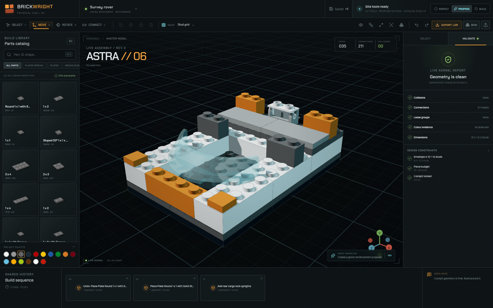

# Brickwright

**Agent-native 3D CAD for physically buildable brick models.** Humans and Codex operate the
same revisioned document, catalog, command bus, constraint kernel, proposals, validation,
viewport and undo stack.



This repository is a working vertical slice, not a mock chat interface. You can search the
real LDraw library, click a part into the viewport and watch it mate on real connectors, drag
it with a transform gizmo, box-select a region, rotate, recolour, connect, protect, duplicate,
validate, undo, export and replay the model manually. A WebMCP adapter exposes those same
semantics as dynamic Site Tools.

## Run it

```bash
nvm use                 # Node 24
npm run bootstrap       # exact npm ci + committed catalog integrity verification
npm run dev:inner       # http://localhost:4173, credential-free local CAD
```

The compiled catalog is committed, so a fresh clone runs immediately. The command above is
the same credential-free server exercised by automated acceptance. Run `npm run dev` when you
also want accounts, email and analytics: it wraps the same server in `hexclave dev`, starts
the local Hexclave dashboard and injects the project ID. `hexclave.config.ts` remains the
source of truth for which Hexclave apps are installed.

Open the page in the ChatGPT desktop app's built-in browser to make native Site Tools
discoverable. In a normal browser the same tools are exposed as a deterministic development
bridge:

```js
await window.brickwright.invoke('workspace_get', {})
await window.brickwright.invoke('catalog_search', { text: 'slope 45', requireGeometry: true })
await window.brickwright.invoke('render_capture', { view: 'front', mode: 'beauty' })
```

## The catalog is real, and it says what it does not know

`tools/catalog-compiler.mjs` compiles three independently licensed datasets into immutable
runtime assets. Measured output of the committed build (`catalog/2026-07`):

| Measurement | Value |
| --- | --- |
| Total searchable identities | **81,774** |
| …LDraw-modelled identities | **22,941** (17,982 parts + 4,959 shortcuts) |
| …catalogued-only identities, from the Rebrickable catalogue | **58,833** |
| …of which LDraw `~` helper parts, hidden from default search | 2,741 |
| Retired part numbers resolved to their replacement | **1,150** (e.g. `3023` → `3023b`) |
| Parts with authoritative LDCad connection metadata | **17,364** (75.7%) |
| Normalized connectors compiled | **324,331** |
| LDraw colours from `LDConfig.ldr` | **322** |
| Parts with official-set colour production evidence | 5,119 |
| Parts with a resolved category | 11,192 |
| Identity crosswalk to Rebrickable | 5,465 exact (136 of them via an LDraw rename) · 5,727 heuristic base-design |
| Parts with compiled geometry (the runtime pack) | **900** · 961,732 triangles · 47.7 MB |
| Rendered palette thumbnails | **900** · 2.0 MB · colour-independent |
| Unresolved LDraw references during geometry compilation | **0** |
| LDraw source licensing observed | 22,941 files CC BY 4.0 |

### Three tiers, and search says which one it found

The index answers for the whole catalogue, and every result carries how much this build
actually knows about it:

| Tier | Count | What is known | What you can do |
| --- | ---: | --- | --- |
| `placeable` | **900** | Compiled geometry, measured envelope, LDCad connectors | Build with it |
| `modelled` | **22,041** | LDraw models the shape and connections; no mesh in this build | Inspect it |
| `catalogued` | **58,833** | Name, category and official-set appearances, and nothing else | Confirm it is real |

That distinction is the point. *"We have never heard of that part"* and *"that part is real
and this build cannot place it"* are different answers, and both a human and an agent need
to be told which one they are getting. `catalog_search` reports `tier` on every hit, facet
counts across all three, and `cataloguedTierSearched` so a zero is never mistaken for a fact.

The wider catalogue is a separate 7 MB payload, hash-verified like every other asset and
fetched the first time anybody searches past the modelled library — an editing session never
pays for it.

Search is ranked rather than filtered: an exact part number wins, then a name match, then a
measured envelope, then a word buried mid-string, with official-set frequency breaking ties.
`2 x 4`, `2x4`, `3001`, `slope 45` and `minifig head` all do what they look like they should,
and results page rather than stopping at an arbitrary cap.

Asking the agent to place a search-only part returns a teaching error rather than a guess:

```text
[GEOMETRY_UNAVAILABLE] Part 3023 (Plate 1 x 2) exists in catalog 2026-07 but has no
compiled geometry in this build.
Repair: call catalog_search with requireGeometry=true and choose a part that can be placed.
```

There is no procedural fallback catalog. If the compiled assets are missing, Brickwright
refuses to start and says so, because *"is this a real LEGO part?"* must always have a
defensible answer — and with 81,774 indexed identities, that answer now covers the catalogue
rather than the subset this build can draw.

LDraw renames parts across updates and leaves the retired number behind as an alias file.
Those numbers stay in circulation for years, so a rename is treated as an authoritative
statement that two numbers denote the same element: lookups and searches follow it, and a
live record with no identity of its own adopts the retired number's external identity,
colour evidence and set frequency.

### Recompiling from source

```bash
npm run catalog:sources   # LDraw complete.zip + LDCad Shadow Library + Rebrickable CSV → .sources/
npm run catalog:build     # → public/catalog/<version>/ + public/assets/geometry/<sha256>.bwmesh
npm run catalog:test-fixture   # refresh the 40-part slice the unit tests run against
```

The compiler resolves LDraw type-1 dependency trees, honours `BFC CERTIFY`/`INVERTNEXT` and
matrix handedness, inherits colour 16/24, splits quads, captures type-2 hard edges, applies
crease-angle smoothing, and packs each part into a SHA-256-named binary container. It parses
and expands LDCad `SNAP_CYL`/`CLP`/`FGR`/`GEN`/`SPH` with `SNAP_INCL`, `SNAP_CLEAR` and grid
expansion, inherits subpart connectors through type-1 transforms, and joins Rebrickable
identities, categories, colour evidence and set-appearance frequency. `npm run
catalog:fixture` verifies the whole pipeline against committed deterministic fixtures.

## What works today

- **Pure TypeScript CAD document** in LDraw's native frame, storing orientation as an exact
  orthonormal basis rather than Euler angles — the same nine numbers an LDraw type-1 line
  carries, so arbitrary rotations and mirrored references round-trip exactly. Three.js and
  React are derived views, never the source of truth.
- **Real compiled LDraw geometry** streamed as content-addressed binary meshes, shared per
  definition, with per-slice materials for colours baked into a part.
- **Direct manipulation that is measured, not assumed** — a part is placed by clicking where
  it goes, with a ghost that resolves through the same connector solver a commit uses, and
  moved with a translate/rotate gizmo whose drawn handles the browser acceptance run measures
  in screen pixels. Shift-drag selects a region. Nothing in the viewport bypasses the kernel:
  a drop and a drag are each one atomic, reversible transaction.
- **Enforced asset integrity** — catalog payloads and meshes are byte-counted and SHA-256
  verified before parsing; the mesh decoder rejects malformed counts, slices, bounds,
  non-finite coordinates and out-of-range indices before anything reaches Three.js.
- **Authoritative connection semantics** from the LDCad Shadow Library — including details a
  nominal model would miss, such as the centre tube on a 2×2 brick.
- **Data-derived stacking** — mating planes come from each part's own connectors, so slopes,
  curved bricks, grille tiles and windscreens land correctly.
- **Bounded AI request lifetimes** — uploads, model work, and corrective retries share
  a deadline; cancellations propagate upstream, and incomplete streams cannot release
  agent tool calls or automatically apply pending builds. See [AI stream reliability](docs/ai-stream-reliability.md).
- **Shared command bus** — human and agent edits create the same atomic `Transaction` records.
- **Optimistic concurrency** — every mutation checks `expectedRevision`; stale plans fail
  with repair guidance.
- **Kernel protection** — agent edits cannot mutate protected parts or locked subassemblies.
- **6-DOF connector snapping** — the solver composes connector frames
  (`Tm = Tt·Ft·C·Fm⁻¹`), so it derives orientation as well as position. Studs-not-on-top
  placement, right-angle Technic and hinge halves fall out of the same expression as
  ordinary stacking. Continuous joint parameters are solved in closed form; a mate requires
  aligned axes, not merely coincident points.
- **Persistent connection edges** — each mated pair is recorded with its joint freedom,
  the revision it appeared at and its provenance, so the structural graph survives save,
  load and export.
- **Articulated mechanisms** — hinges, pins, axles, bars and ball joints can be driven from
  the inspector or by the agent, carrying everything rigidly attached to the moving side.
  Stud connections are treated as rigid, because a built brick wall does not hinge.
- **Triangle-confirmed collision** — box broad phase, then a mated-connector clearance
  allowance, then `three-mesh-bvh` triangle-pair confirmation. Every verdict carries its
  certainty (`exact`, `clearance-subtracted`, `unknown`) and the UI shows it, so a result
  reached from bounding boxes alone never reads like a verified one.
- **Connection-graph connectivity** — components, loose groups and weak single-connector
  attachments come from actual mated connectors.
- **Preflight + ghost proposals** — dry-run edits stay visible without mutating the document;
  collision-free proposals apply atomically.
- **Dynamic WebMCP surface** — Inspect, Propose and Build modes register different tool
  inventories, revoked through `AbortSignal`.
- **Agent perception** — `render_capture` returns live PNG pixels plus revision, camera,
  bounds, count and selection metadata.
- **Colour honesty** — 322 real LDraw colours; part/colour pairings with no observed
  official-set appearance are reported as *virtual*, not illegal.
- **Rendered part previews** — the palette shows each part rasterized offline from its own
  compiled geometry, tinted at display time: RGB carries shading and alpha carries coverage,
  so one asset serves all 322 LDraw colours.
- **Derived build order** — sequencing is a precedence problem over the connection graph, so
  steps are generated with the checkable guarantee that every part attaches to structure
  placed earlier, or is reported as beginning a separately-built subassembly.
- **Interoperability** — `.ldr` and `.mpd` export with `STEP` boundaries and one submodel per
  subassembly; import flattens nested submodels and reports every reference it could not
  place. BOM CSV carries exact LDraw and external identities.
- **Printable build guides** — one self-contained offline HTML artifact with a cover, BOM,
  fixed-camera step renders, visually highlighted new parts, build-order verification,
  warnings and dataset provenance. Its renderer is deterministic and testable without WebGL.
- **Project archives** — export and import a project as JSON, carrying the document,
  transaction history, notes and constraints, not only an `.ldr` snapshot. The Export
  Center is the human path; `session.exportArchive` / `importArchive` is the kernel path.
- **Curated megabuilds** — ten kernel-gated published sets (1,080–11,493 editable parts),
  shown on `/` and `/explore`. **Edit this build** copies the snapshot into a new project
  and opens `/editor?project=…`; the published bytes do not change. See
  [landing and explore](docs/integration/landing.md).
- **Design partner** — Inspect / Propose / Build in the editor's right dock. The model
  reads and preflights; a person (or Build-mode session) commits through the same kernel
  path as a click. See [agent workbench](docs/integration/agent-workbench.md).
- **Generation and refinement** — a brief becomes a build graph the snap solver realises;
  a region doctor proposes a cheaper, healthier replacement and reports the delta. Both
  apply as ordinary transactions. See [generation](docs/integration/generation.md) and
  [refinement](docs/integration/refinement.md).
- **Mechanism planners** — `build_crane`, `build_lattice`, `build_snot_hull` and
  `build_clock_faces` emit real compiled parts and joints, not placeholders. Scope and
  honesty notes are in [CAD editing](docs/cad-editing.md).
- **Instanced rendering** — parts sharing a definition and colour render as one
  `InstancedMesh`, with each batch's hard edges merged into a single buffer. Measured in the
  browser: 400 extra parts cost 14 extra draw calls, against 810 before merging.
- **Durable local-first projects** — every committed transaction is appended to an IndexedDB
  log on top of a periodic checkpoint, so reopening replays forward from the checkpoint.
  Replay stops at a revision gap rather than applying a log out of order, and the save
  indicator reports whether persistence is durable, memory-only or failing.
- **Complete, branch-aware cloud history** — cloud downloads and conflict recovery read
  every page against a fixed revision, including edits inherited at each branch's fork
  point. A missing edit or checksum mismatch returns an actionable error instead of
  quietly opening a partial model. The authenticated history API gives agents the same
  revision/cursor contract. See [cloud history](docs/cloud-history.md).
- **Safe cloud saves and claim retries** — snapshots are validated before any durable
  write, so a rejected upload cannot leave a ghost project or consume a version label.
  Interrupted claims can resume the exact original upload without duplicating edits or
  overwriting newer work. Humans and agents share the same authenticated save contract.
  See [cloud save integrity](docs/cloud-save-integrity.md).
- **Atomic batched cloud sync** — claims and offline catch-up send up to 50 edits
  per request, preserving every human/agent transaction. Failed batches save no
  partial history, and lost acknowledgements retry without duplicate edits.
  See [batched synchronization](docs/cloud-batched-sync.md).
- **Validated transaction histories** — cloud saves and reads check complete
  edit/undo shapes and change-tracking metadata, not just checksums. Malformed
  history is refused without partial writes or silent local-history replacement.
  See [transaction integrity](docs/cloud-transaction-integrity.md).
- **Retry-safe conflict recovery.** Interrupted uploads resume on the same seeded
  fork, preserving original human and agent edits without duplicate branches.
  See [conflict recovery](docs/cloud-conflict-recovery.md).
- **Recoverable collaboration invitations** — native Hexclave email, bounded
  delivery attempts, owner retry controls, and retry-safe acceptance give humans
  and agents the same truthful status and recovery contract. Expired invitations
  no longer block replacements. See [invitation lifecycle](docs/cloud-invitation-lifecycle.md).
- **Enforced agent contract** — one Zod declaration produces both the JSON Schema each tool
  advertises and the validation the gateway applies, so they cannot drift. Errors pass through
  a single redactor that strips credentials, signed URLs, blobs and filesystem paths and never
  relays a stack trace. A versioned tool profile hash lets a plan be refused when the surface
  it was made against no longer exists.

## Building at scale: one instruction, a whole storey

Placing a model brick by brick is slow, and it is where quality is lost. A wall
authored one part at a time by a language model has stacked seams, unbonded courses and
corners that do not tie. `src/cad/assembly.ts` is a parametric assembly solver that does the
bricklaying, and the kernel then checks the result like any other edit.

```js
// One call. Not 62.
await window.brickwright.invoke('action_mutate', {
  action: 'build_enclosure',
  expectedRevision: 7,
  args: { widthStuds: 20, depthStuds: 16, courses: 5, floor: true, color: 4,
          openings: [{ atStud: 8, widthStuds: 4, fromCourse: 0, toCourse: 3 }] },
})
// → 84 parts in 5 courses, every course staggered against the one below.

await window.brickwright.invoke('action_mutate', { action: 'stack_selection', args: { copies: 4 } })
// → 336 parts placed in 4 storeys, each 136 LDU above the last.
```

Measured on that exact pair of calls: **420 parts, 3,372 mated connectors, 0 collisions, 0
loose groups, one connected component**, sequenced into **53 verified build steps in 324 ms**.

| Generator | What it solves |
| --- | --- |
| **`build_structure`** | **A whole building.** Deck, storeys, real window and door frames seated in the openings, a contrasting band between storeys, and a roof deck with a parapet — one instruction, one transaction |
| `build_wall` | A bonded run: courses offset so no seam runs through two of them, exact coverage from real part lengths, openings that hold real elements |
| `build_enclosure` | Four walls whose corners interlock — the X and Z runs alternate which goes full length each course — over a deck the walls stand on |
| `build_field` | A floor, roof or baseplate, with staggered rows and an optional second cross-bonded layer that makes it a rigid slab rather than loose plates |
| `stack_selection` | A tower from one storey: the selection is measured between its own mating planes and repeated upward, snapped to the plate grid |
| `build_hinged_flap` | A flap that opens: a hinge line and a panel the kernel reads as a real revolute joint and carries the rigid island with |
| `capture_module` / `stamp_module` | Author a bay once and place it everywhere. A module is captured into its own frame, so it stamps onto the ground wherever it was built, and a quarter turn rotates it about its own footprint |

### A city block in four instructions

```js
const call = (action, args) => window.brickwright.invoke('action_mutate',
  { action, expectedRevision: window.brickwright.getDocument().revision, args })

await call('build_structure', { widthStuds: 16, depthStuds: 14, storeys: 3, coursesPerStorey: 6,
                                color: 4, bandColor: 15, windowsPerSide: 2, door: true })
await call('capture_module',  { name: 'Corner block' })
await call('stamp_module',    { module: 'Corner block', atLdu: [360, 0, 0], copies: 2,
                                spacingLdu: [360, 0, 0], color: 14 })
await call('stamp_module',    { module: 'Corner block', atLdu: [0, 0, 320], quarterTurns: 1, color: 2 })
```

Measured: **1,304 parts, 8,832 mated connectors, 0 collisions, 4 buildings, in 6.6 seconds.** Each
call is one undoable transaction.

An opening is not just a hole. `build_wall` and `build_structure` seat a real compiled window
or door frame in it, chosen by measured footprint, and the element decides the course span —
a frame that does not reach the top of its hole would leave a gap. Where the pack has no frame
of that width, the plan says so and cuts a bare opening instead of pretending.

The courses immediately above and below an opening **bridge its edges** rather than placing
their own seam there. Without that, a doorway's two edges continue as one unbroken vertical
joint through the whole wall and the run beside it comes away as a separate column — sound in
the render, in pieces when you pick it up.

Nothing here estimates. Lengths and course pitch come from the compiled envelope of parts
this build can actually place, never from a hardcoded table. Every plan returns a report —
part count, courses, the full bill, and **every course it could not fully bond** — so a
caller can check the work instead of trusting it. And it is all ordinary `part.add`
operations, so the revision guard, protected regions, hard constraints and triangle-confirmed
collision detection all still apply, a whole building previews as a ghost before it is
accepted, and one `⌘Z` reverses it.

The same generators are in the human Command Deck under **ASSEMBLE**, and the mechanism
planners sit under **MECHANISM**, because parity between the two operators is an invariant
of this project rather than a slogan.

## Physics, and what it is honest about

`src/cad/statics.ts` answers what collision cannot: does the model stand up, and what is
holding it together. The compiler measures each part's **exact enclosed volume** from its
compiled surface, so mass, centre of mass, the support polygon and the tipping margin are
measurements rather than bounding-box guesses. The sample rover the unit tests build on
reports **67.8 g, stable with 80 LDU of margin, on an 8 × 12 stud footprint**. It is a
fixture, not what the editor opens with. A new project is empty; the empty
viewport offers **Start with a brick** and one-click forks of curated megabuilds
rather than a blank grid with nowhere to go.

Two numbers are not measurements and say so in every report that uses them:

- **Mass runs 8–15% heavy.** A 2 × 4 brick computes at 2.67 g against a moulded 2.32 g,
  because LDraw models an idealized solid. The bias is uniform, so centre of mass, load share
  and tipping margin are unaffected — and it is stated rather than scaled away.
- **Clutch capacity is an assumption.** LEGO publishes none; 100 gf per stud is the
  conservative end of independent measurements, and it is carried in the report.

Clutch resists being *pulled apart*, so the analysis walks upward from whatever rests on the
ground and treats anything the walk never reaches as hanging, with the whole cluster's mass on
the connections into it. A brick resting on a brick is compression and is not flagged.

## Looking like plastic

The viewport generates its own studio environment — a three-band sky, an overhead softbox and
a low bounce, prefiltered through `PMREMGenerator` — because a build guide that phones out for
an HDR is not self-contained. Materials are injection-moulded ABS: a satin dielectric under a
tighter clearcoat, lit to agree with the softbox baked into the environment. Window frames are
seated in white and glazed in Trans-Clear rather than inheriting the wall colour, which is what
stops a generated facade reading as a wall with holes in it.

## Tool surface

Inventories are **24 / 28 / 40** tools (Inspect / Propose / Build) on profile
`brickwright.tools/3`. Changing autonomy revokes the previous set through `AbortSignal`
before the next one is registered.

| Always readable (Inspect) | Propose mode adds | Build mode adds |
| --- | --- | --- |
| `workspace_get` | `build_preflight` | `build_apply` |
| `workspace_reveal` / `workspace_focus` | `proposal_create` | `builder_feedback_respond` |
| `catalog_search` | `generation_preview` | `undo_edit` / `redo_edit` |
| `part_inspect` | `refinement_select` | `action_mutate` |
| `scene_query` |  | `generation_apply` |
| `render_capture` |  | `refinement_apply` |
| `validate_model` |  | `project_open` / `project_create` / `project_fork` / `project_delete` |
| `builder_feedback_get` |  | `share_fork_to_project` |
| `capabilities_search` / `capabilities_help` / `action_read` |  |  |
| `part_intent_resolve` |  |  |
| `project_list` |  |  |
| `generation_compile` / `generation_set` / `generation_run` / `generation_state` / `generation_cancel` |  |  |
| `refinement_analyse` / `refinement_propose` / `refinement_state` / `refinement_cancel` |  |  |
| `share_prepare` |  |  |

`generation_compile` takes `useModel` (default `true`). `useModel: false` is the
in-browser rule compiler — the same decision used to be a second tool,
`generation_compile_local`, which is gone.

Behind `action_read` / `action_mutate`: the parametric assembly generators, the mechanism
planners, LDraw and MPD export, BOM, catalog coverage, weak attachments, duplicate, mirror
and note responses. Generation, refinement, IndexedDB projects and local share freeze/fork
are dedicated tools, not `action_mutate` capabilities. Annotations are hints only — revision
checks, protected-region enforcement, geometry availability, colour policy and collision
rejection live in the CAD kernel.

## Verification

```bash
npm run check            # lint + ~2,900 vitest tests + Convex/functions typecheck + production build
npx playwright install chromium
npm run test:e2e         # smoke: catalog, meshes, WebMCP, persistence and delivery output
npm run test:e2e:all     # every suite under tools/e2e/ plus smoke, one shared server
npm run verify:all       # check + demos:check + the full browser matrix
```

`npm run check` is the unit-and-build gate CI always blocks on. `verify:all` is the
workstation gate: it also rebuilds the published demos byte-identically and runs every
browser suite. Hosted CI also runs `audit:runtime` and `demos:check` before splitting
those suites — `landing`, `production` and `share` block
deploy; `e2e-smoke` and `renderer` run on GPU-less runners as signal only. `cad-editing`
runs in `test:e2e:all` and is not on the hosted matrix. Details in
[docs/deployment.md](docs/deployment.md).

The browser run asserts relationships rather than magic numbers: that the placeable set is a
strict subset of the catalog, that compiled `.bwmesh` assets actually reach the GPU, that
preflight does not mutate, that acceptance is one revision, that an unplaceable identity is
refused, that a stale plan is rejected, and that the export's type-1 line count matches the
document — and imports back as the same build.

It asserts that a generated building is actually good: that one call produces a whole storey,
that the report says running bond and the kernel agrees there are no collisions, that the bill
accounts for every part placed, that two generator calls are exactly two undoable
transactions, and that the result still sequences into a verified instruction set. It then
raises a three-storey building with seated windows and a door from a single instruction,
captures it as a module, stamps a second copy of it, and asserts the block is collision-free
and that the stamp placed exactly as many parts as the module holds.

It also asserts that the index reaches the whole catalogue: that the total exceeds the
modelled library by tens of thousands of identities, that an exact part number ranks first,
that a whole-catalogue search still surfaces buildable parts rather than burying them, that
paging is deterministic across repeated calls, and that the panel a human uses reports the
same 81,774 identities the agent sees.

It also asserts the things an interface can get wrong while the code beneath it is correct:
that the transform gizmo's *drawn* handles span enough screen pixels to grab, that dragging
them commits exactly one transaction, that a viewport click places exactly one part, that
shift-drag selects a region, that the build sequence is still on screen after an edit, and
that the first-run guide appears once and not again. It also opens the delivery center, verifies a hierarchical MPD, generates the real
printable guide and asserts that its step images are embedded rather than remotely fetched.

Architecture and data-flow details are in [ARCHITECTURE.md](ARCHITECTURE.md); everyday
editing shortcuts in [docs/cad-editing.md](docs/cad-editing.md); how the three deployed
services fit together — and the two configuration mistakes that fail silently — in
[docs/deployment.md](docs/deployment.md); workstream contracts in
[docs/integration/](docs/integration/README.md); remaining production work in
[PROGRESS.md](PROGRESS.md). The August 2026 audit at
[docs/improvements/](docs/improvements/README.md) and the specs under
[docs/specs/](docs/specs/README.md) are dated snapshots, not a description of HEAD.

## Licence

Brickwright's own source is licensed **AGPL-3.0-only** (see `LICENSE`). Because the network
clause applies, anyone who runs a modified Brickwright as a hosted service owes their users
the modified source.

That covers the code only. The compiled catalog assets are derivatives of three independently
licensed datasets, and their terms travel with them rather than with this licence — including
the CC BY-SA obligation on connector metadata, which is a separate copyleft from the AGPL and
is not satisfied by it. See below.

## Dataset attribution

Brickwright's code is separate from the datasets it compiles. The compiler writes
`catalog/<version>/licenses.json` recording, per dataset, what attribution redistribution
requires.

- **LDraw Parts Library** — geometry, part identity and the LDraw colour table. Every part
  file in the committed build is licensed CC BY 4.0; the compiler records observed licences
  per file rather than assuming one. LEGO® is a trademark of the LEGO Group, which does not
  sponsor, endorse or authorise LDraw or Brickwright.
- **LDCad Shadow Library** (Roland Melkert) — connection metadata, licensed CC BY-SA 4.0.
  Whether the normalized connector dataset constitutes a ShareAlike adaptation needs a
  focused licence review before public redistribution.
- **Rebrickable bulk catalog** — names, categories, colour production evidence and set
  frequency, fetched for local compilation. Redistribution rights for compiled derivatives
  are unspecified and must be reviewed against current Rebrickable terms before deployment.

This repository is an engineering artefact, not legal advice.
